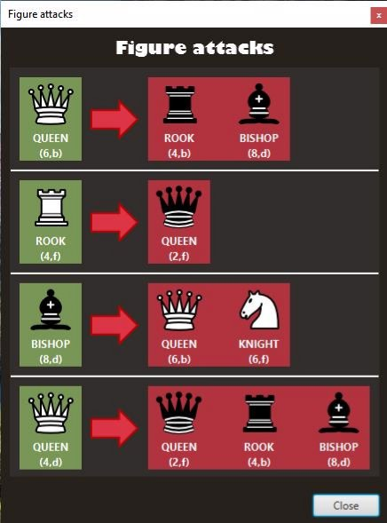

# CHESS GAME
**ІНСТРУКЦІЯ КОРИСТУВАЧА** 

1. Робота з програмою 

Після запуску  виконавчого  файлу   з розширенням \*.exe, відкривається головне вікно програми (Рисунок 6.1). 

Рисунок 6.1 – Головне вікно програми 

Далі у користувача є 3 варіанти роботи меню. Натиснувши першу кнопку “Start  game”  зеленого  кольору  програма  запустить  гру  зі  стандартним розташуванням  фігур.  Друга  кнопка  “Load  game  file”  жовтого  кольору відповідає за завантаження користувацького ігрового файлу. При натисканні на цю  кнопку  програма  запропонує  користувачу  завантажити  свій  файл  з розташуванням  фігур  (Рисунок  6.2).  Третя  кнопка  “Exit  game”  червоного кольору відповідає за вихід з гри. Після натискання вікно гри буде закрите а програма зупиниться.  

Рисунок 6.2 – Завантаження власного файлу гри 

Важливо що користувацький файл з розташуванням фігур повинен мати розширення \*.txt. Також вміст файлу повинен відповідати вимогам Рисунок 6.3. 

Рисунок 6.3 – Файл розташування фігур 

Вимоги до заповненого файлу розташування фігур наступні 

1. Колір фігури **white** або **black** 
1. Назва фігури на вибір **king**, **knight**, **queen**, **rook**, **bishop** 
1. Розташування фігури по X число від 0 до 7 
1. Розташування фігури по Y число від 0 до 7 
1. Фігури не повинні розміщуватися на одній клітинці 
1. Дані розділені пробілами 
1. Кількість записів не більше 10 

Якщо вимоги до користувацького файлу не витримані, то буде виведено повідомлення про неправильний формат файлу. (Рисунок 6.4) 

Рисунок 6.4 – Повідомлення про неправильний формат файлу 

Після  завантаження  користувачем  свого  файлу  або  вибору  гри  за замовчуванням.  Програма  запускає  гру  розташовує  фігури  на  шахівниці  та вираховує атаки відповідно до вибраного розташування. Рисунок 6.5 

Рисунок 6.5 – Гральна шахівниця з розташованими фігурами 

Зразу  після  запуску  гри  користувач  бачить  шахівницю  та  фігури розташовані на ній.  

На головній сторінці гри розташоване навігаційне меню з кнопками та написами для взаємодії з грою. (Рисунок 6.6) 

Основні компоненти меню 

1. “Save game” – збереження усіх атак фігур у файл  
1. “Show attacks” – перегляд усіх атак фігур на шахівниці  
1. “Clear field” – очищення ігрового поля 
1. Вміст файлу  
1. Назва файлу 
1. “Upload” – завантаження нового файлу з розташуванням фігур 

Відображається назву файлу який був вибраний або назва стандартного файлу зі розташуванням фігур під назвою init.txt. 

Рисунок 6.6 – Навігаційне меню гри 

Користувач може переглядати атаку та доступні варіанти переміщення на шахівниці  для  вибраної  фігури  для  цього  потрібно  навести  курсор  миші  на фігуру  розташовану  у  будь  якій  клітинці  шахівниці.  див.  Червоним  будуть відмічені фігури які знаходяться під атакою вибраної фігури, а жовтим буде відмічено усі доступні клітинки для переміщення даної фігури. (Рисунок 6.7) 

Рисунок 6.7 – Перегляд атаки та пересування для вибраної фігури Користувач може розміщувати фігуру на шахівниці у певну клітинку для цього потрібно натиснути праву кнопку миші у вибраній клітинці. Після чого користувач отримає перелік доступних фігур для розташування (Рисунок 6.8). 

Максимальна  кількість  фігур  для  розміщення  на  шахівниці  10.  Меню виводиться при натиску правою кнопкою миші на будь яку вільну клітинку за умови що розташовано менше 10 фігур. 

Рисунок 6.8 – Список доступних фігур для розміщення 

Якщо  немає  доступних  фігур  для  розміщення  користувач  отримає повідомлення (Рисунок 6.9). 

Рисунок 6.9 – Повідомлення про те що немає доступних фігур для розміщення  Якщо  користувач  спробує  розмістити  фігуру  в  уже  зайнятій  клітинці програма  запропонує  видалити  дану  фігуру  та  виведе  для  цього  кнопку (Рисунок 6.10).  

Рисунок 6.10 – Кнопка видалення фігури 

Користувач  може  переглянути  список  усіх  атак  натиснувши  кнопку “Show attacks”. Після чого відкриється діалогове вікно зі списком усіх атак. (Рисунок 6.11).  

Рисунок 6.11 – Вікно зі списком яка фігура кого б’є  

Користувач може зберегти список атак у файл натиснувши кнопку “Save game”. Після чого буде виведено вікно для вибору місця збереження вихідного файлу. (Рисунок 6.12) 

Рисунок 6.12–Вікно вибору папки збереження файлу  

Коли  файл  буде  збережено  виведеться  повідомлення  про  успішне збереження файлу. (Рисунок 6.13) 

Рисунок 6.13–Повідомлення про успішне зберігання  

2. Формат вхідних та вихідних даних 

Користувачем подається на вхід власний файл з розташуванням фігур або програма  сама  розташовує  фігури  у  стандартному  положенні.  Для  файла користувача  буде  виконано  валідацію  відповідності  правилам  заповнення файлу. Користувач може редагувати файл під час гри та змінювати файл на інший. 

Результатом  виконання  програми  є  список  яка  фігура  кого  б’є.  Даний список можна зберегти у вигляді текстового файлу у вибраному користувачем розташуванні. 

| #  | Мінімальні  |  Рекомендовані                          |   
|-----|:--------------|:----------------------------------------|
| Операційна система  | Windows 7/ Windows 8 | Windows  10/Windows 11                  |   |   |
| Процесор  | Intel® Pentium® ІІІ1.0 GHz або  AMD Athlon™ 1.0 GHz  | Intel® Pentium® D або AMD Athlon™ 64 X2 |   |   |
| Оперативна пам'ять  | 256 MB RAM (для  Windows® XP) / 1 GB RAM (для Windows Vista/Windows 7/Windows 8/Windows 10)  | 2 GB RAM                                |   |   |
| Відеоадаптер  | Intel GMA 950 не менше 64 МБ  | Intel GMA 950 не менше 64 МБ            |   |   |
| Дисплей  | 1024х768  | 1280х800 або краще                      |   |   |

    Додаткове програмне забезпечення:  JRE (Java Runtime Environment 1.8.0) або вище
